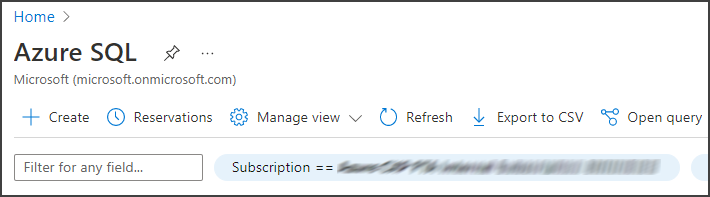
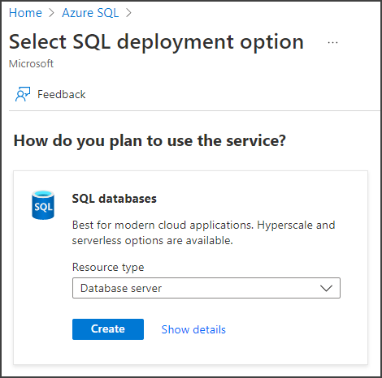
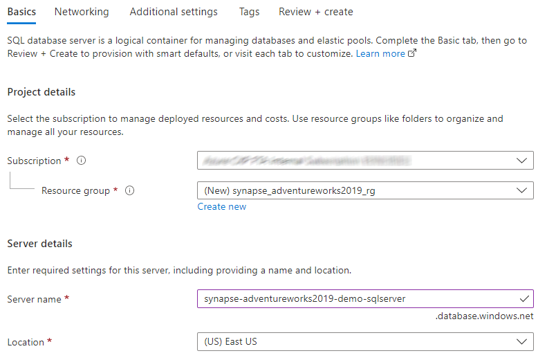
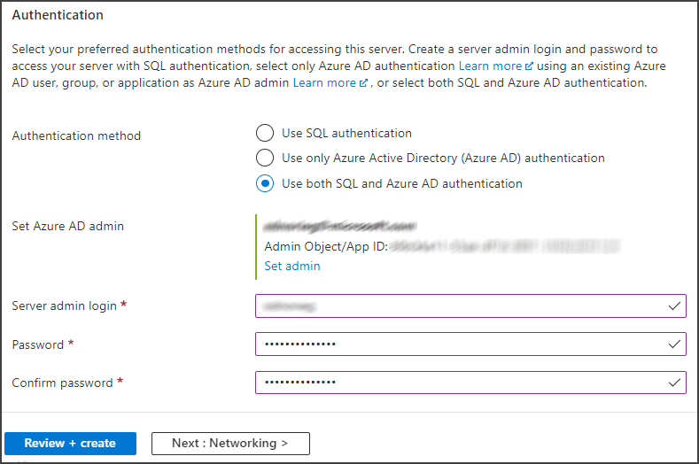
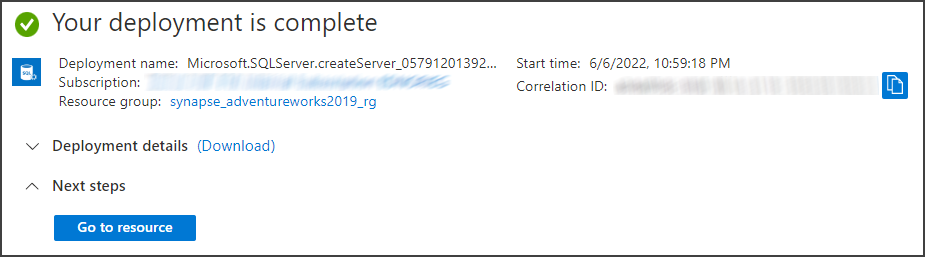

# Synapse_AdventureWorks2019
Synapse demo using AdventureWorks2019 data

In this repo we demonstrate some Azure Synapse Analytics functionality using AdventureWorks2019 Database data.

### Table of Contents

**[AdventureWorks2019 Database](#adventureworks2019-database)** 
**[Download AdventureWorks sample database](#download-adventureworks-sample-database)** 
**[Create Synapse Workspace](documentation/Create_Synapse_Workspace.md#create-synapse-workspace)** 
**[Connect Synapse to GitHub](documentation/Create_Synapse_Workspace.md#connect-synapse-to-github)** 
**[Ingest AdventureWorks2019 into Data Lake](documentation/Ingest_To_DataLake.md#ingest-adventureworks2019-into-data-lake)** 
**[Create Synapse Notebook](documentation/Synapse_Notebook.md#create-synapse-notebook)** 
**[Create a dedicated SQL pool](documentation/Ingest_To_DW.md#create-a-dedicated-sql-pool)** 

## AdventureWorks2019 Database

Let's start by creating a Database Server to host the AdventureWorks2019 database.

Search for Azure SQL in the search box on the top of the Azure portal and let's create a new SQL server by clicking the Create button.

On the SQL databases tile, in the Select SQL deployment options page, select Database server and click Create.

In the Create SQL Database Server page, select the Subscription and enter the Resource group (we recommend creating a new Resource group for this demo) enter the server's name.

Enter the authentication information and click the Review + create button.

On the Review + create tab click the Create button.

Wait until the deployment is completed and click Go to resource.

## Download AdventureWorks sample database

Go to https://docs.microsoft.com/en-us/sql/samples/adventureworks-install-configure?view=sql-server-ver16&tabs=ssms

Download AdventureWorks2019.bak file and follow the steps described in that document.

Next: **[Create Synapse Workspace](documentation/Create_Synapse_Workspace.md#create-synapse-workspace)** 
