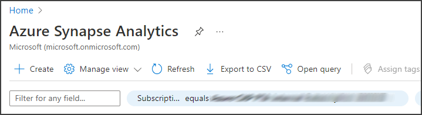
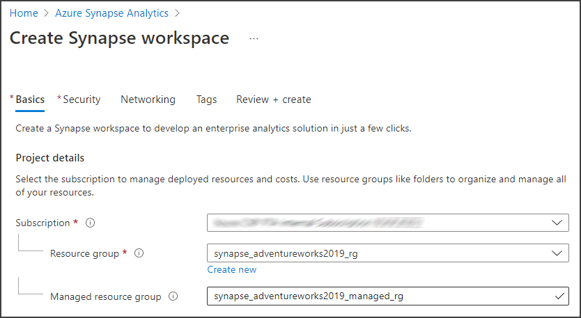
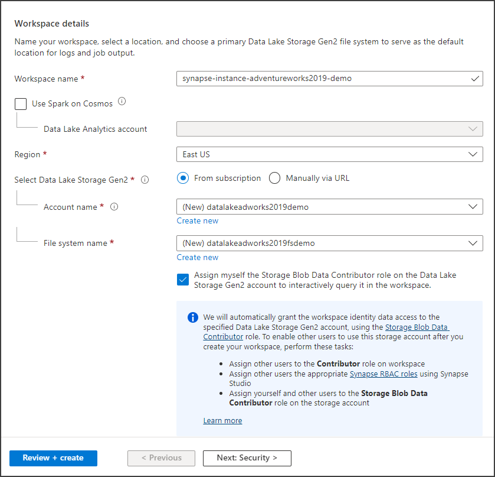
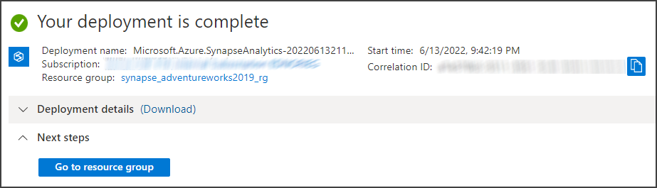
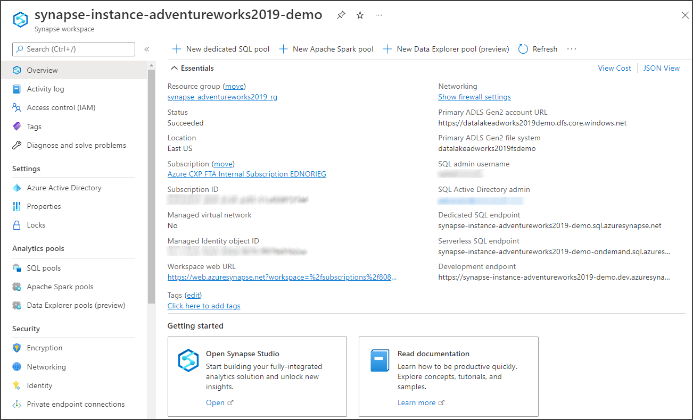
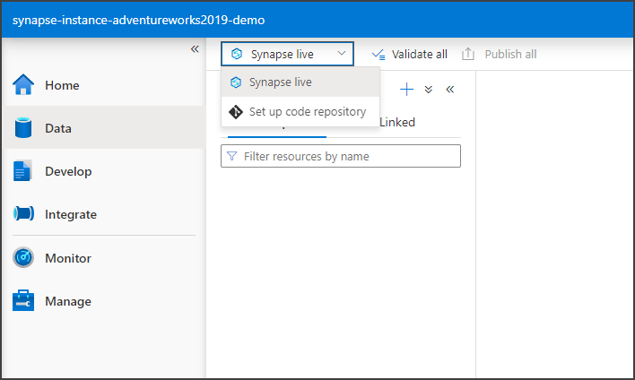
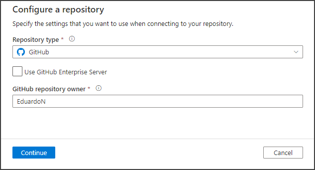
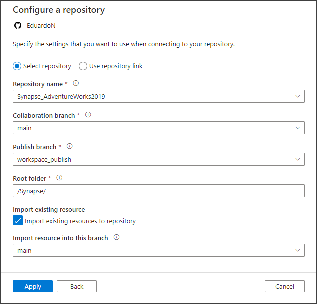
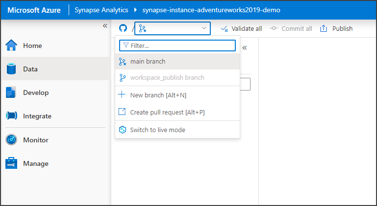

# Synapse_AdventureWorks2019
Synapse demo using AdventureWorks2019 data

In this repo we demonstrate some Azure Synapse Analytics functionality using AdventureWorks2019 Database data.

### Table of Contents

**[Create Synapse Workspace](#create-synapse-workspace)** 
**[Connect Synapse to GitHub](#connect-synapse-to-github)** 
**[Ingest AdventureWorks2019 into Data Lake](Ingest_To_DataLake.md#ingest-adventureworks2019-into-data-lake)** 
**[Create Synapse Notebook](Synapse_Notebook.md#create-synapse-notebook)** 
**[Create a dedicated SQL pool](Ingest_To_DW.md#create-a-dedicated-sql-pool)** 

## Create Synapse Workspace

Let's create a Workspace of Synapse.

Search for Synapse in the search box on the top of the Azure portal and click on Azure Synapse Analytics.

In the Azure Synapse Analytics page, click the Create button.

In the Create Synapse workspace page, select the Subscription, select the Resource group (we recommend selecting the same Resource group you created for the Azure SQL Database, in the previous step of this demo), enter the name for the managed resource group.

On the Workspace details section, enter the workspace name, create a new Data Lake Storage Gen2 account, a new File system and click the Review and create button.

Once the Validation succeeds, click the Create button and wait until the deployment is completed. Once it is completed, click Go to resource.

## Connect Synapse to GitHub

Search for Synapse in the search box on the top of the Azure portal and click on Azure Synapse Analytics.

In the Azure Synapse Analytics page, you will see the Workspace you just created. Click on it and then click on Open Synapse Studio.

Once on Synapse Studio, let's set up a code repository.

Click on the Data tab on the left. on the Data page expand the dropdown Synapse live on the top and click on Set up code repository.

The Configure a repository panel opens on the left. Select the repository type. I am connecting this workspace to this very GitHub repo. If you select GitHub then enter the repository owner and click Continue at the bottom.

Fill the rest of the fields like Repository name, Collaboration branch, Publish branch, Root folder, etc. and click Apply.

Synapse will complete the configuration process and will notify you that the repo is connected. It will also ask you to set the working branch.

Once that is done, you will see that the live mode dropdown changed to a repository icon with options to create a new branch, create a pull request or switch back to live mode. We will use those options next.

Next: **[Ingest AdventureWorks2019 into Data Lake](Ingest_To_DataLake.md#ingest-adventureworks2019-into-data-lake)** 