# Synapse_AdventureWorks2019
Synapse demo using AdventureWorks2019 data

In this repo we demonstrate some Azure Synapse Analytics functionality using AdventureWorks2019 Database data.

### Table of Contents

**[Create a dedicated SQL pool](#create-a-dedicated-sql-pool)** 
**[Ingest Models into dedicated SQL pool](#ingest-model-into-dedicated-sql-pool)** 

## Create a dedicated SQL pool

In this step let's ingest the generated models into Azure dedicated SQL pool.

Let's start by creating a dedicated SQL pool.

Go to the Manage tab , select SQL pool in the Analytics pool group 

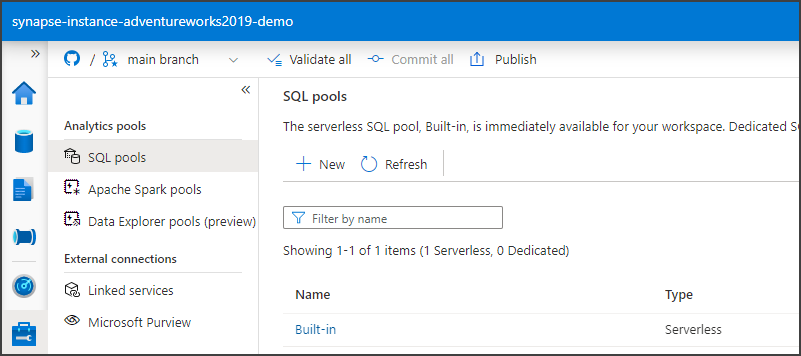

Click on the New button to create a dedicated SQL pool, put a name on it, I will call it "aw2019_demo_synapse_sql_pool", set an appropriate size, I set it as DW300C and click Review and create

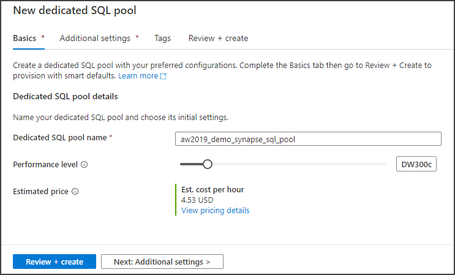

In the next tab, once the validation succeeded, click the Create button and wait for the deployment to complete.

## Ingest Model into dedicated SQL pool

Click on the Integrate tab, expand Pipelines, click on Pipelines Actions in the ... and click New pipeline.

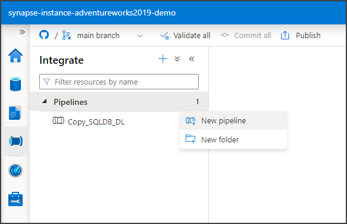

Set the name of the pipeline as CopyGoldToDW, add a Description and collapse the Properties panel by clicking the properties icon above the panel.

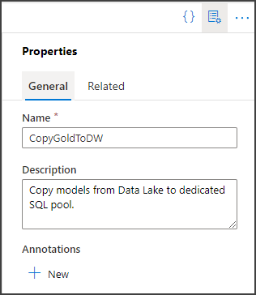

On the Activities search for Copy and drag Copy data to the canvas.

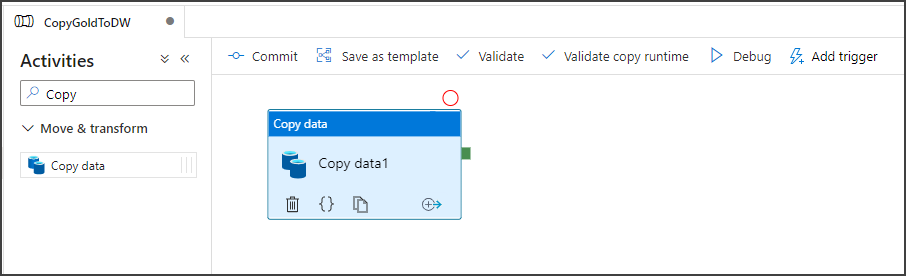

On the General tab, name the activity as Copy person.

On the Source tab, click the New button to create a Source dataset. 

Search for Data Lake and click on Azure Data Lake Storage Gen2. 

Click Continue. On the next page select Parquet as the format and click Continue. 

On the next page name, the source dataset as SourceDataset_person and select the existing linked service. I named it "synapse-instance-adventureworks2019-demo-WorkspaceDefaultStorage".

Navigate to the delta folder by clicking the Browse icon and navigating to adventureworks2019 > delta > personGoldTable. Click Ok. 

On the Set properties panel click Ok.

Having the Source dataset created, still in the Source tab, select Wildcard file path and as the Wildcard file name enter *.

On the Sink tab click the New button to create a new dataset. Search for dedicated and select Azure Synapse dedicated SQL pool, click Continue.

Set a name for the dataset, I named it "DestinationSqlPool_person", as the SQL pool select the pool we created in the section before, I named it "aw2019_demo_synapse_sql_pool". On the Table name select the Edit checkbox to put a name to the table. I called it Model as the prefix and  PersonTypeByEmailPromotion. On Import schema select None as the actual table name and click Ok.

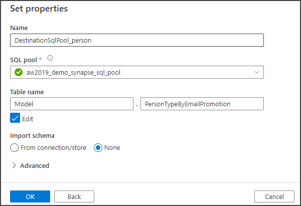

Having the Sink dataset created, select Auto create table in the Table option

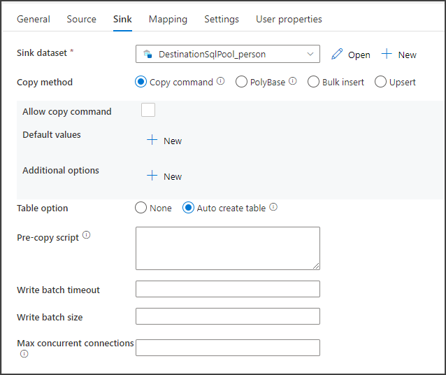

Click the Validate button. Your pipeline should be validated correctly.

Click Commit all to commit all your changes to the Git repo.

Hit the Debug button to run the activity.

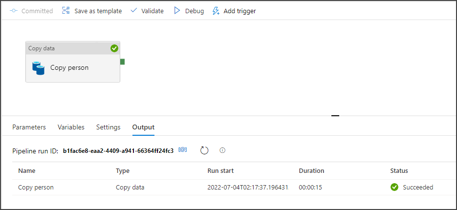

Let's copy now the product model.

Grab another Copy data activity and drag it to the canvas and name it Copy product. Drag the connector from Copy person and link it to Copy product.

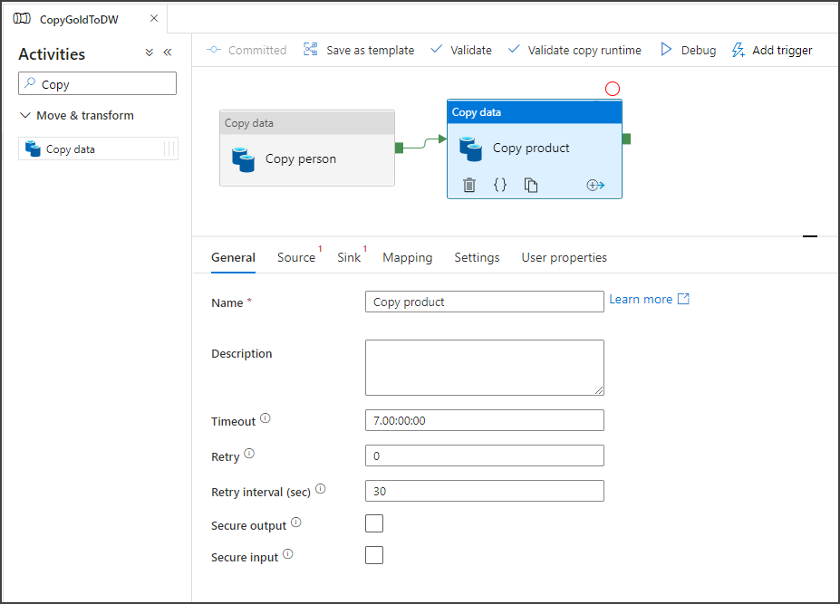

On the Source tab create a new Source dataset by clicking the New button.  

Search for Data Lake and click on Azure Data Lake Storage Gen2. 

Click Continue. On the next page select Parquet as the format and click Continue. 

On the next page name, the source dataset as SourceDataset_product and select the existing linked service. I named it "synapse-instance-adventureworks2019-demo-WorkspaceDefaultStorage".

Navigate to the delta folder by clicking the Browse icon and navigating to adventureworks2019 > delta > productGoldTable. Click Ok. 

On the Set properties panel click Ok.

Having the Source dataset created, still in the Source tab, select Wildcard file path and as the Wildcard file name enter *.

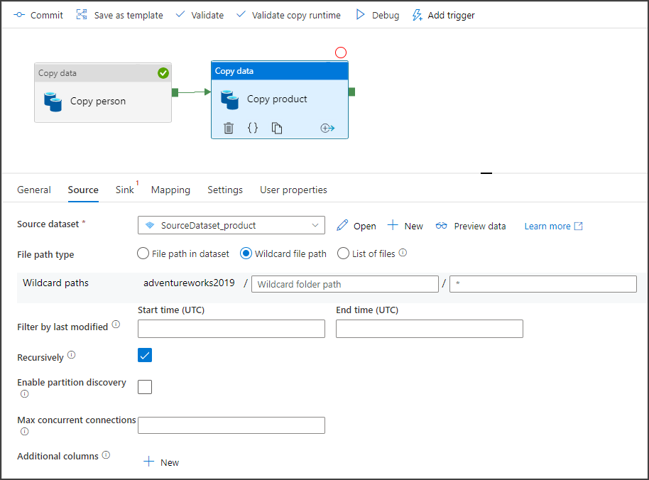

On the Sink tab click the New button to create a new dataset. Search for dedicated and select Azure Synapse dedicated SQL pool, click Continue.

Set a name for the dataset, I named it "DestinationSqlPool_product", as the SQL pool select the pool we created in the section before, I named it "aw2019_demo_synapse_sql_pool". On the Table name select the Edit checkbox to put a name to the table. I called it Model as the prefix and  ProductByColor. On Import schema select None as the actual table name and click Ok.

Having the Sink dataset created, select Auto create table in the Table option.

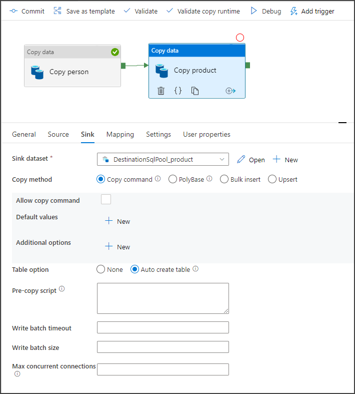

Click the Validate button. Your pipeline should be validated correctly.

Click Commit all to commit all your changes to the Git repo.

Hit the Debug button to run the pipeline.

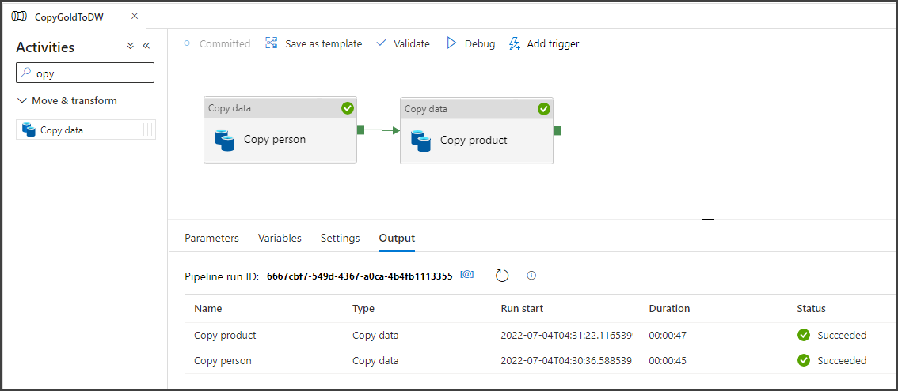

After executing this pipeline, if you go to the Data tab, click on Workspace, expand the dedicated SQL Pool, you will see the two Model tables, and if you right click on any of them and select New SQL script > Select TOP 100 rows, you will see the imported data.

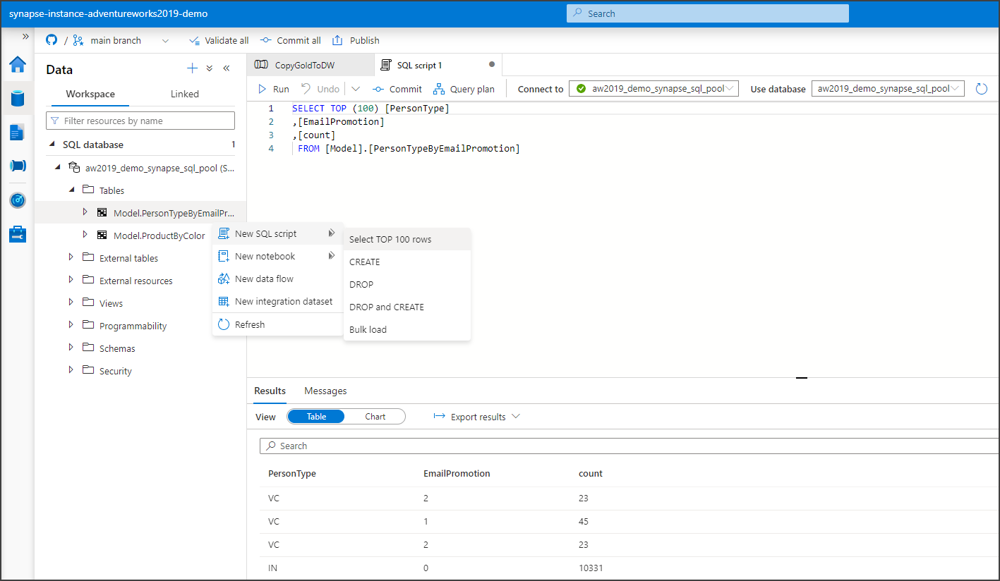

Finally, let's trigger the pipeline. To do that click the Publish button on the top of Synapse Studio. Click Ok on the Pending changes panel, and wait for the publishing to complete as well as for the templates to get generated. After that, click Add trigger > Trigger now, click Ok on the Pipeline run panel and the pipeline will be kicked off.

On the Monitor tab, on Pipeline runs under Integration you will see the pipeline execution.

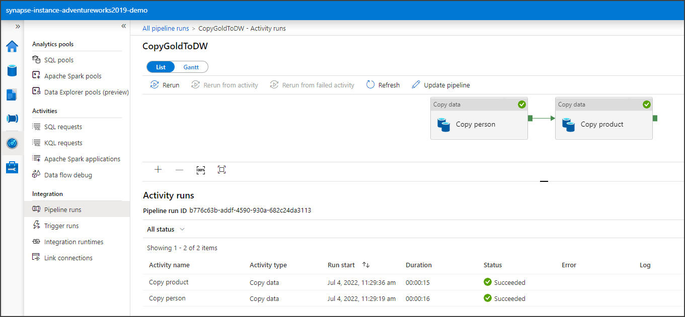