# Synapse_AdventureWorks2019
Synapse demo using AdventureWorks2019 data

In this repo we demonstrate some Azure Synapse Analytics functionality using AdventureWorks2019 Database data.

### Table of Contents

**[Ingest AdventureWorks2019 into Data Lake](#ingest-adventureworks2019-into-data-lake)** 
**[Create Synapse Notebook](Synapse_Notebook.md#create-synapse-notebook)** 
**[Create a dedicated SQL pool](Ingest_To_DW.md#create-a-dedicated-sql-pool)** 

## Ingest AdventureWorks2019 into Data Lake

Let's start by ingesting AdventureWorks2019 database into Data Lake.

Click on the Home tab in Synapse Studio, and then click on the Ingest option to trigger the Copy Data tool.

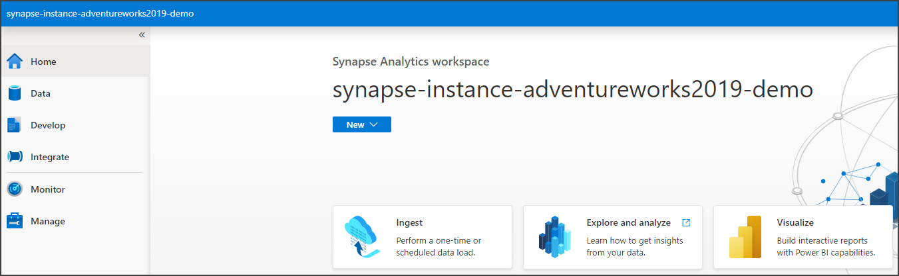

In the Copy Data tool click Built-in copy task and leave selected Run once now radio button. Click on the Next button.

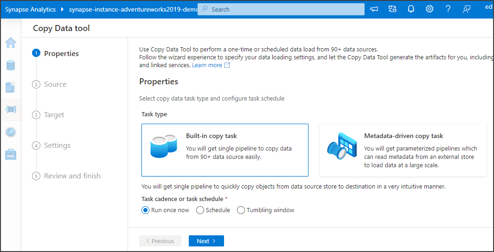

On the Source data store step, expand the Source type dropdown, search for database and select Azure SQL Database. 

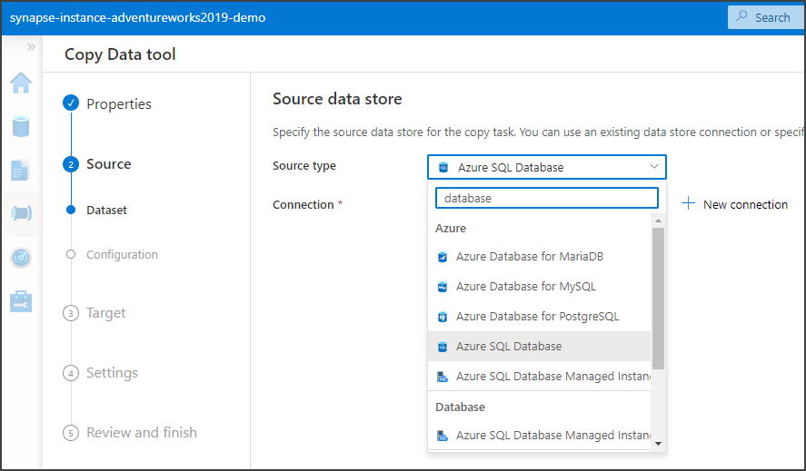

To set the Connection, click the New connection button and lets configure a new linked service.

On the New linked service page, select the subscription where you created the Azure SQL Database that host AdventureWorks2019, select the Server name and Database name. Select and authentication type, I recommend System Assigned Managed Identity. If you select that, grant workspace service managed identity access to your Azure SQL Database by following this documentation.

https://docs.microsoft.com/en-us/azure/data-factory/connector-azure-sql-database?tabs=data-factory#managed-identity

Once configured, test the connection and click the Commit button.

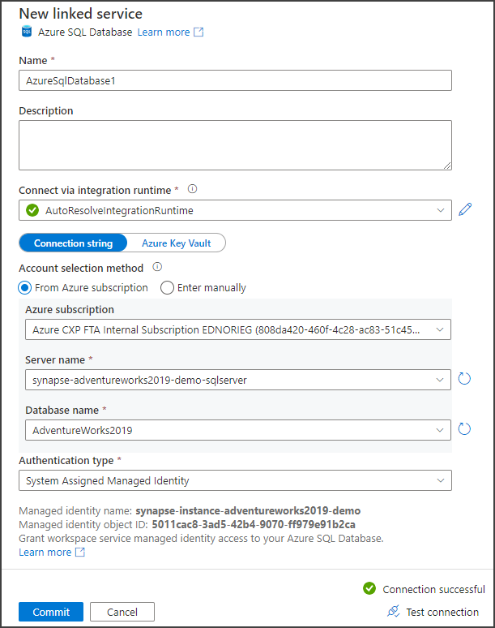

Back to the Source data store step, leave the Esisting tables radio. All tables are listed, select the tables Person.EmailAddress, Person.Person and Production.Product and click Next.

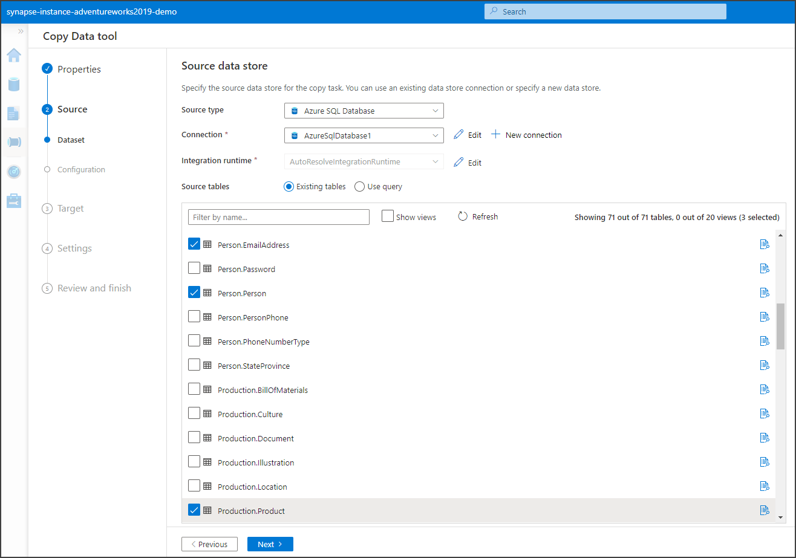

Leave the Apply filter step as is, and click the Next button.

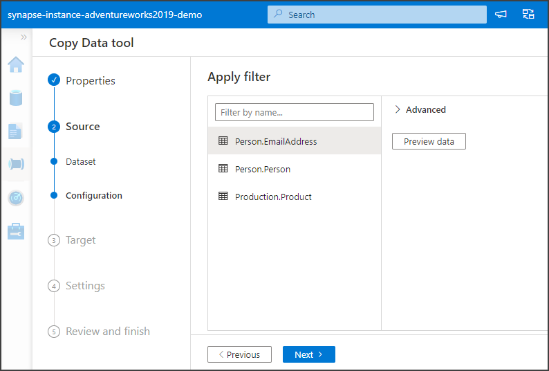

The wizard will take few seconds to gather all database metadata.

On the Destination data store, search for data lake and select Azure Data Lake Storage Gen2

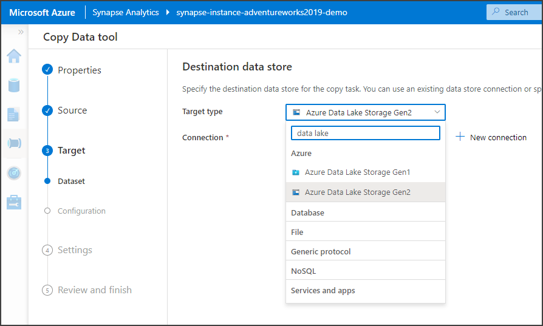

In the connection dropdown select the already existing connection to Synapse integrated Data Lake. That will show you some additional options.

As folder name enter adventureworks2019. As file name suffix enter .parquet, and then click Next.

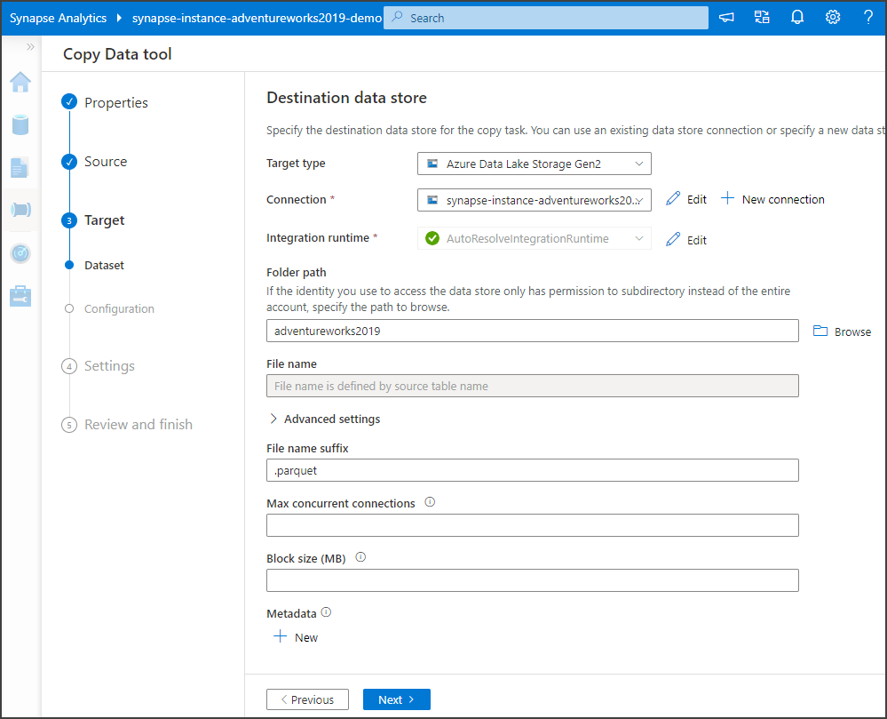

Leave the File format settings step as is.

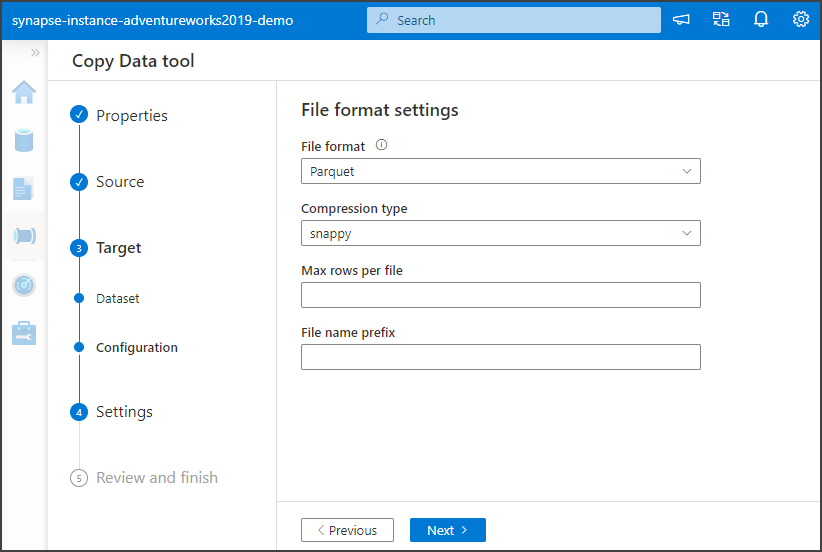

In the Settings page enter a name for the task and a description and click Next.

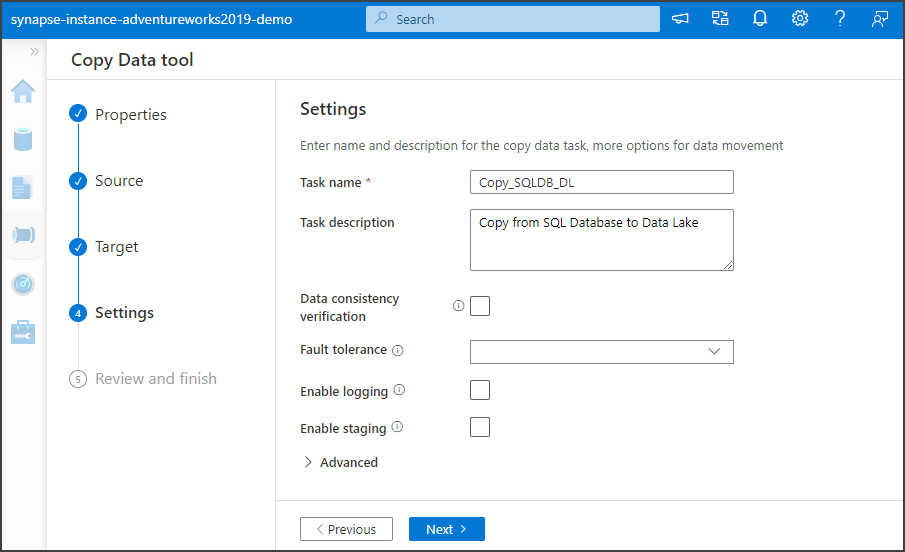

The Copy Data tool shows you a Summary page, click the Next button.

Wait until the deployment is completed and click the Finish button.

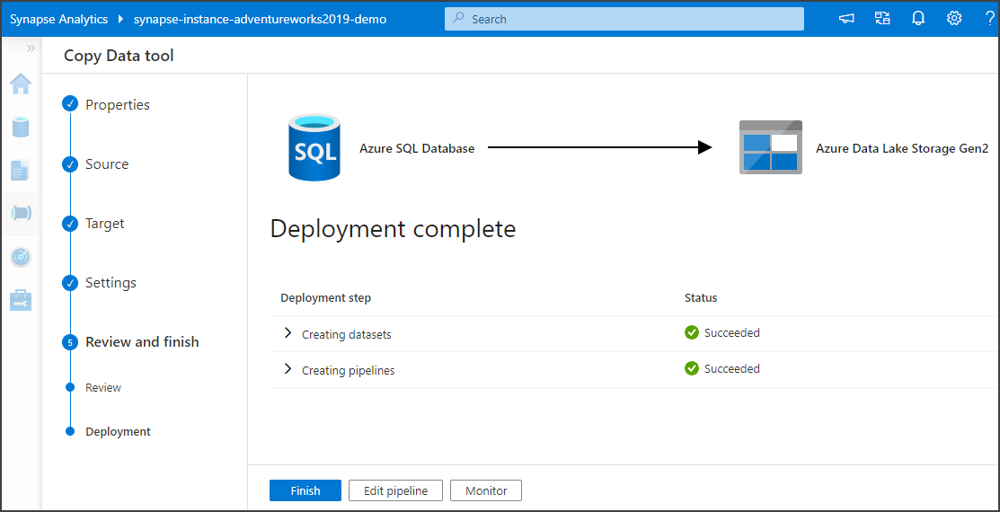

The pipeline gets created. Select it and you will see it contains a ForEach that will go through the tables we selected in the database invoking a Copy activity to copy each table.

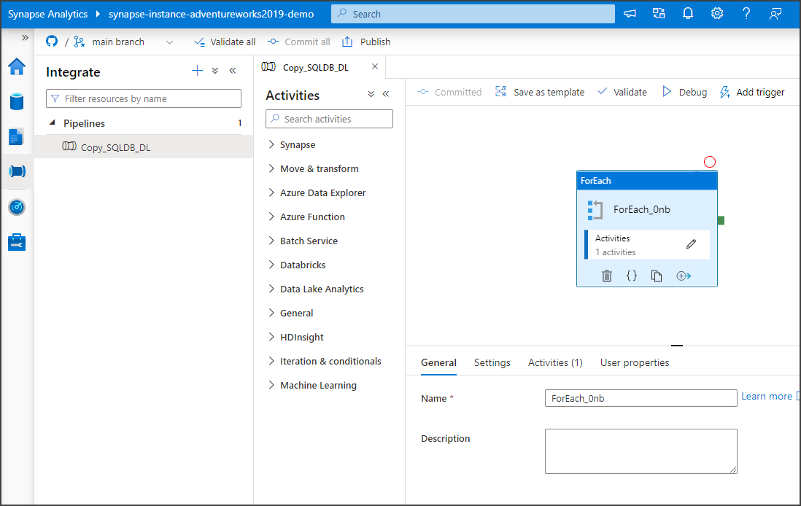

Click the Publish button at the top, wait for it to generate all the pending changes and click OK to trigger the publishing.

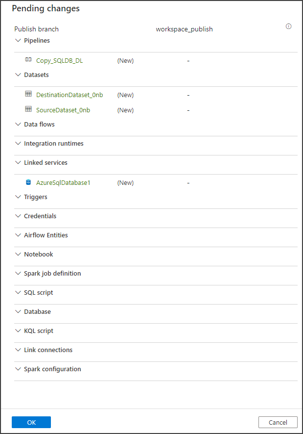

Wait until you get the notification that the publishing completed, and the templates were generated.

Trigger the pipelines by clicking the Add trigger button and selecting Trigger now. On the Pipeline run window click OK.

The pipeline will trigger. To monitor the progress, click on the Monitor option on the left and select Pipeline runs. Wait for the pipeline execution to complete.

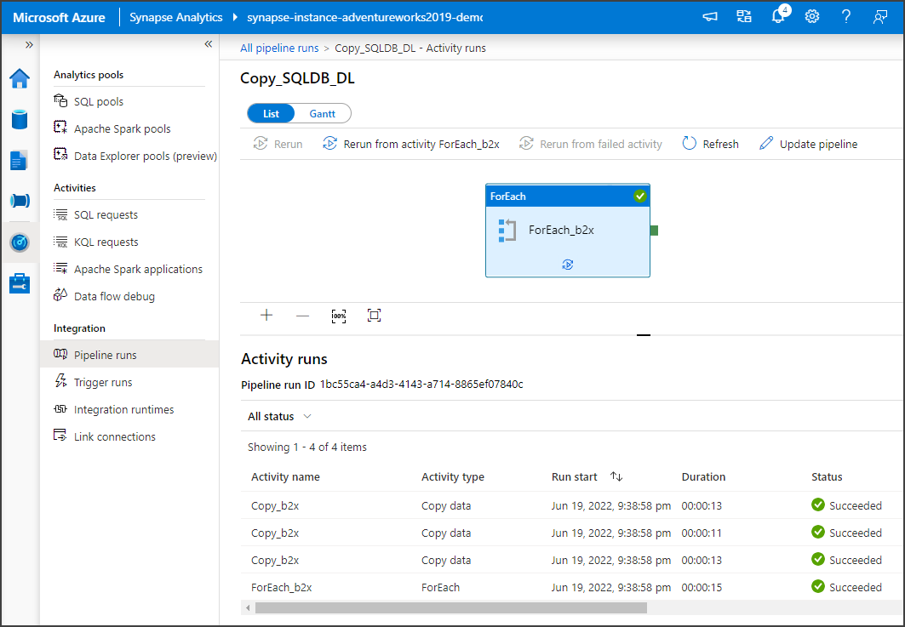

To see the generated files, on the left click on Data, on the Data page click on Linked. Expand Azure Data Lake Storage Gen 2, expand the Data Lake instance (in this demo we called it synapse-instance-adventureWorks2019-demo), click on the adventireworks2019 folder, and there you will see the three generated parquet files.

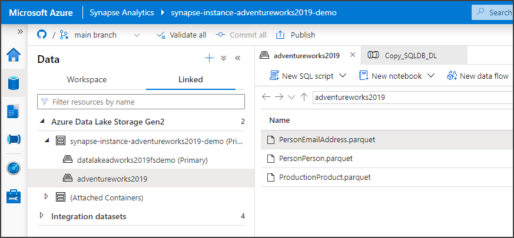

Done.

Next: **[Create Synapse Notebook](Synapse_Notebook.md#create-synapse-notebook)** 