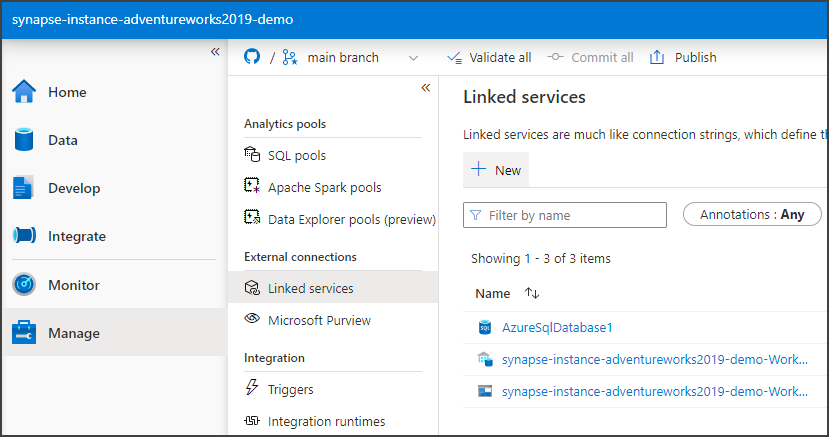
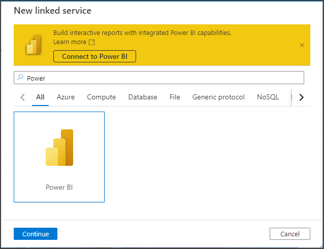
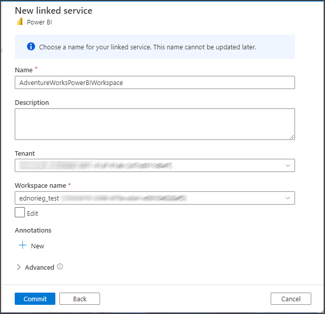
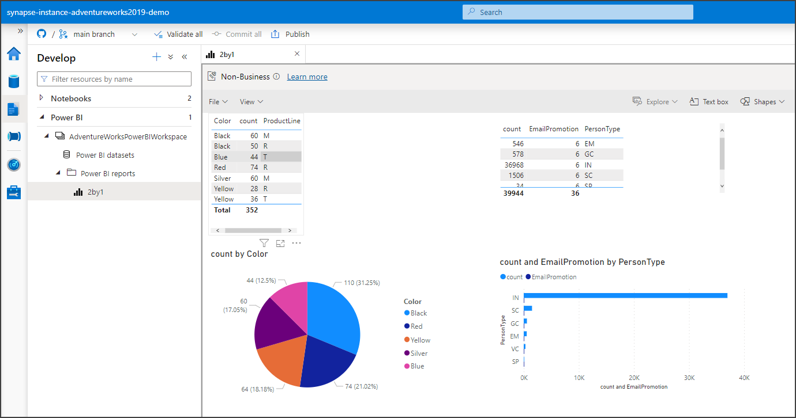

# Synapse_AdventureWorks2019
Synapse demo using AdventureWorks2019 data

In this repo we demonstrate some Azure Synapse Analytics functionality using AdventureWorks2019 Database data.

### Table of Contents

**[Create PowerBI Report](#create-powerbi-report)** 
**[Link PowerBI workspace](#link-powerbi-workspace)** 

## Create PowerBI Report

Let’s work on displaying our models in a PowerBI report integrated with Synapse.

For this section you will need to have a PowerBI workspace. If you don't have one, create one using this documentation: https://docs.microsoft.com/en-us/power-bi/collaborate-share/service-create-the-new-workspaces

## Link PowerBI workspace

To link our Power BI workspace with our Synapse workspace we will follow this Quickstart:
https://docs.microsoft.com/en-us/azure/synapse-analytics/quickstart-power-bi

In Synapse Studio click on Manage > Linked services and click the New button.

In the New linked service panel search for "Power", select Power BI and click Continue.

In the next step give a name to the linked service and select the Power BI workspace. Click the Commit button.

After the workspace is linked, on the Develop tab you will be able to browse your Power BI datasets, edit and create Power BI reports directly from Synapse Studio.

The report we are showing on this screenshot, is listing both Product and Person information from the models we copied to the dedicated SQL pool.

You can find the pbix file in the PowerBI folder of this repo.