# Synapse_AdventureWorks2019
Synapse demo using AdventureWorks2019 data

In this repo we demonstrate some Azure Synapse Analytics functionality using AdventureWorks2019 Database data.

### Table of Contents

**[Create Synapse Notebook](#create-synapse-notebook)**<br>
**[Create Persons Notebook](#create-person-notebook)**<br>
**[Create Product Notebook](#create-product-notebook)**<br>
**[Ingest Models into dedicated SQL pool](Ingest_To_DW.md#ingest-model-into-dedicated-sql-pool)**<br>

## Create Synapse Notebook

In this step we will create two notebooks. One to process the Persons data and another to process the Products data. 

As part of these notebooks, we will use Delta Lake format and the result will be the creation of two models, one for Persons and one for Products.

Let's get started.

## Create Person Notebook

Let's start by creating a new branch this time.

Go to the Develop tab and expand the source control dropdown that has main branch on it. Select New branch.

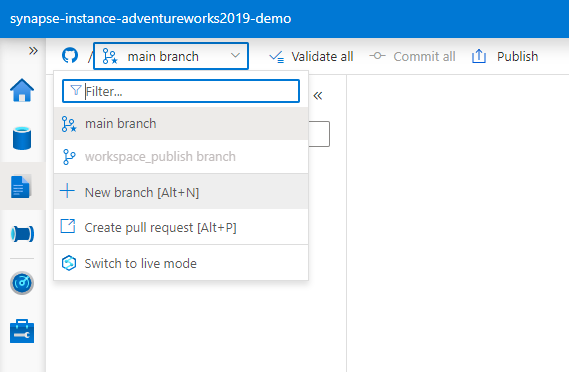

Name the new branch. I recommend putting your alias to avoid a conflict with other people branches, and put a name related to the feature you will develop. I am calling it "eduardo_personNotebook" and click Create.

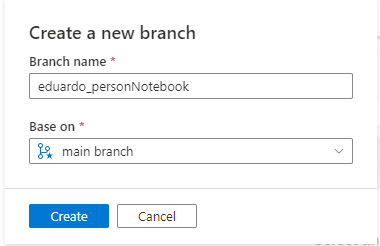

Standing on the new branch, on the Develop tab, click on the + button and select Notebook.

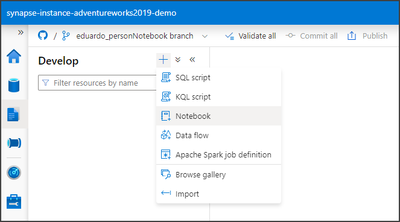

Enter a name and description.

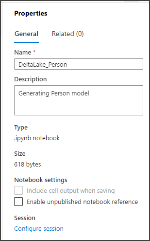

Let's start coding the notebook. Let's create a variable to read from the Person file as well as from the PersonEmailAddress file. Let's also create three variables for the folders Bronze, Silver and Gold for the Delta Lake.
Write this code in the first cell.

```python
#Set up file paths
personEmailRawPath = "abfss://adventureworks2019@datalakeadworks2019demo.dfs.core.windows.net/PersonEmailAddress.parquet"
personRawPath = "abfss://adventureworks2019@datalakeadworks2019demo.dfs.core.windows.net/PersonPerson.parquet"
personBronzeTablePath = 'abfss://adventureworks2019@datalakeadworks2019demo.dfs.core.windows.net/delta/personBronzeTable'
personSilverTablePath = 'abfss://adventureworks2019@datalakeadworks2019demo.dfs.core.windows.net/delta/personSilverTable'
personGoldTablePath = 'abfss://adventureworks2019@datalakeadworks2019demo.dfs.core.windows.net/delta/personGoldTable'
```

To run that code, expand the Attach to dropdown on the top of the Notebook and select Manage pools.

That takes you to the Manage tab, and the Apache Sparks pools page in there. Click the New button.

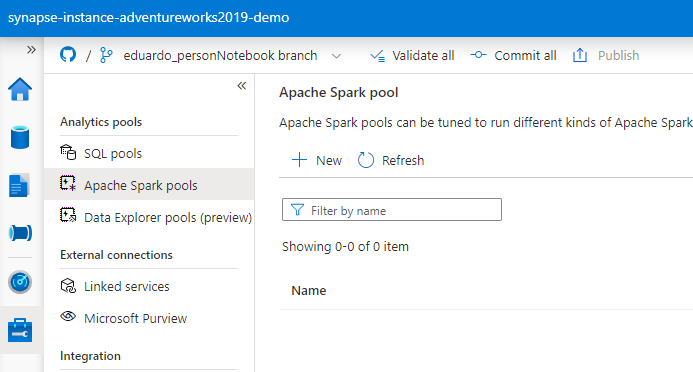

On the New Apache Sparks pool page, enter a name for the pool and click Review + create.

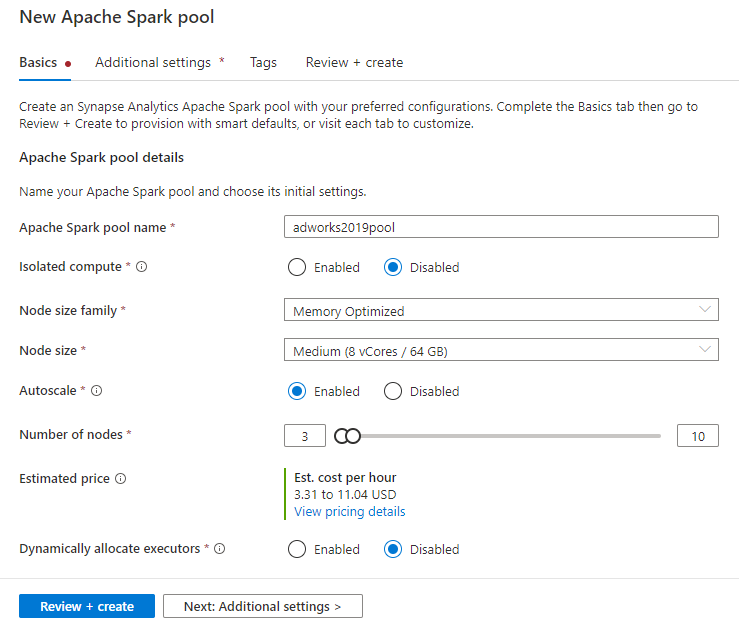

On the Review + create page click the Create button. That will submit the request and create the Apache Spark pool. Wait until the deployment is completed.

Once the deployment is completed. Go back to the Develop tab, expand the Attach to dropdown and select the newly deployed Apache Spark pool. Then click the Run all button to execute the cell.

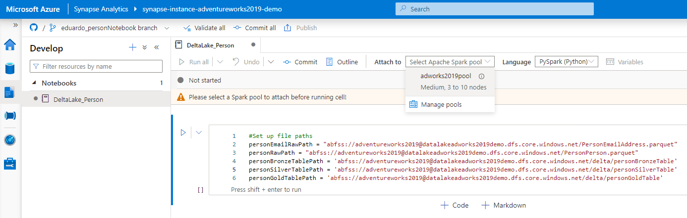

Then click the Run all button to execute the cell. It will take some time to connect, to start the session and to execute the notebook.

Once the execution is completed, Commit your changes.

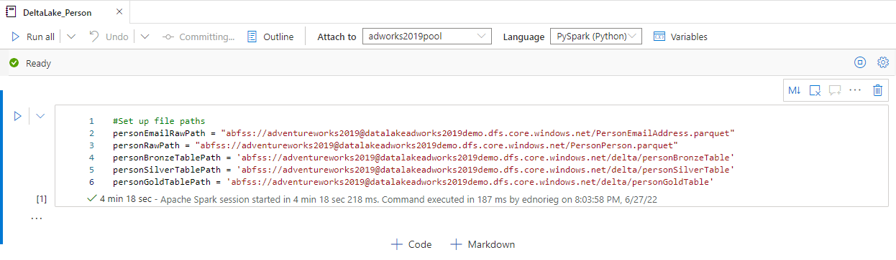

Let's create another cell by pressing the + Code button and let's read the person's data into a dataframe and to display it. Press the run cell button on the left of the cell. Let's execute every new cell you create during the rest of this tutorial.

```python
%%pyspark
df = spark.read.load(personRawPath, format='parquet')
display(df.limit(10))
```

In a new cell, let's save that dataframe into the Bronze folder. Let's use Delta format. Run the cell. The code will look like this:

```python
#Save as Delta Table
df.write.mode("overwrite").format("delta").save(personBronzeTablePath)
```

Next let's create another cell and read from the bronze folder into a new dataframe. Run the cell

```python
#Load Bronze table into dataframe
rawPersonDF = spark.read.format("delta").load(personBronzeTablePath)
rawPersonDF.show()
```

Let's start manipulating the data. In a new cell let's drop the rowguid column. 

```python
#Drop id field
personDF2 = rawPersonDF.drop('rowguid')
personDF2.show()
```

And next let's save the Silver table in another cell.

```python
#Save Silver table
personDF2.write.mode("overwrite").format("delta").option("overwriteSchema", "true").save(personSilverTablePath)
```

Let's create another cell to drop the ModifiedDate column.

```python
#Dropping ModifiedDate column
personDF3 = personDF2.drop('ModifiedDate')
personDF3.show()
```

And next, in a new cell let's combine first, moddle and last name into a new FullName column. Let's drop the three previous columns.

```python
#Concating Region Province Country and droping extra columns
from pyspark.sql.functions import concat_ws,col
personDF4 = personDF3.withColumn("FullName",concat_ws(" ",col("FirstName"),col("MiddleName"),col("LastName"))).drop("FirstName").drop("MiddleName").drop("LastName")
    
personDF4.show()
```

Let's create a new cell to modify the silver table with the resulting dataframe.

```python
#Update Silver Table
personDF4.write.mode("overwrite").format("delta").option("overwriteSchema", "true").save(personSilverTablePath)
```

In a new cell let's group by the data by PersonType and EmailPromotion, counting the elements in each group and sorting the result by EmailPromotion.

```python
personDF5 = personDF4.groupBy("PersonType", "EmailPromotion").count().sort("EmailPromotion")
personDF5.show()
```

And in the last cell let's save the result in the Golden folder.

```python
#Save Gold table
personDF5.write.mode("overwrite").save(personGoldTablePath)
```

To double check the entire notebook, press the Run All button at the top of the notebook to execute every cell.

The notebook should run successfully.

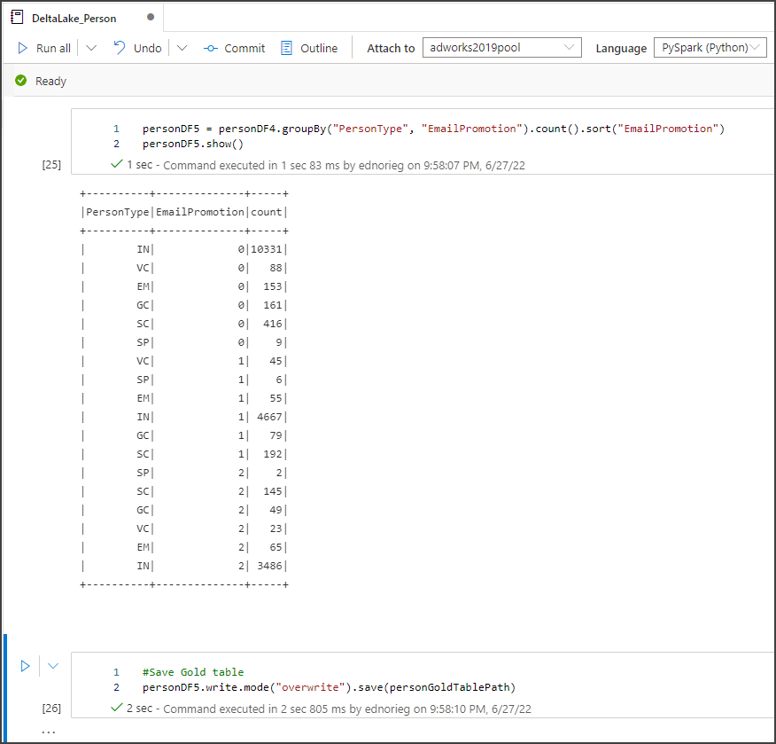

Commit your changes to the Git repo.

As a result of executing this notebook, if you go to the Data tab, click on the Linked services, expand the Azure Data Lake Storage Gen 2, expand the workspace default storage (I called it synapse-instance-adventureworks2019-demo), click on the adventureworks2019 folder, then on the delta folder and then in the personGoldTable folder, you should see the parquet files with the newly generated model.

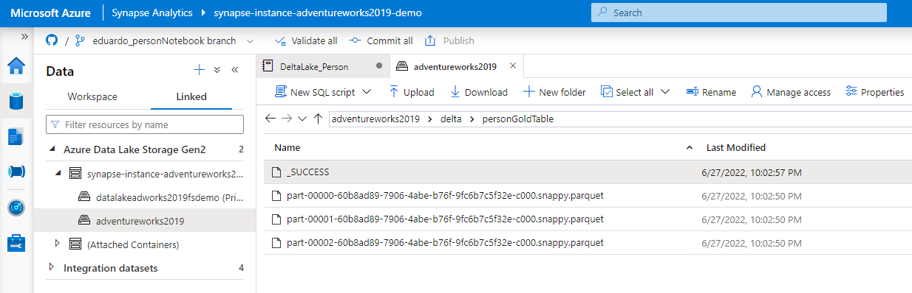

Go back to the notebook and press the Commit button.

Once the commit completed, expand the source control dropdown and let's create a pull request to merge this changes into the Main branch. Click Create pull request.

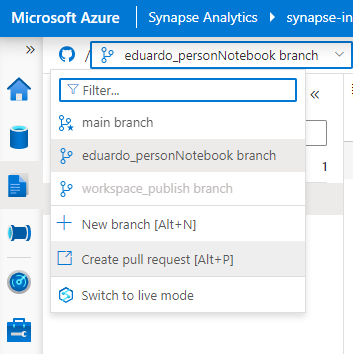

That will open a new browser tab and take you to GitHub, where everything will be ready for you to create the pull request. Click on the Create pull request button and follow the steps.

Once the pull request is created, merge it and delete the branch. You are all set.

Go back to the browser tab where you have Synapse Studio, expand the source control dropdown and select main branch. The dropdown will refresh, and the deleted branch will disappear, and now you are in the main branch with the newly created notebook.

## Create Product Notebook

Let's create a new branch.

In the Develop tab expand the source control dropdown that has the main branch selected. 

Click on New branch. Name the new branch. I will call it "eduardo_productNotebook" and click Create.

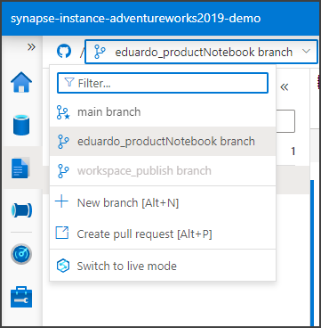

On the Notebooks section, expand the Notebooks Actions by clicking the ... and click on New notebook.

On the Properties window, set the name of the notebook, I will call it DeltaLake_Product. Set a Description and click on the Properties icon above that window to dismiss it.

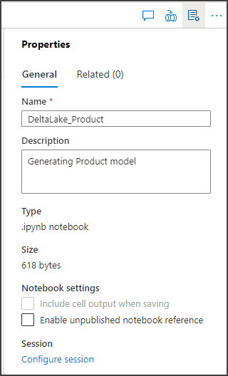

Let's start writing code. Write the following code in the first cell. Attach to the existing pool and click on the Run All button.

```python
#Set up file paths
productRawPath = "abfss://adventureworks2019@datalakeadworks2019demo.dfs.core.windows.net/ProductionProduct.parquet"
productBronzeTablePath = 'abfss://adventureworks2019@datalakeadworks2019demo.dfs.core.windows.net/delta/productBronzeTable'
productSilverTablePath = 'abfss://adventureworks2019@datalakeadworks2019demo.dfs.core.windows.net/delta/productSilverTable'
productGoldTablePath = 'abfss://adventureworks2019@datalakeadworks2019demo.dfs.core.windows.net/delta/productGoldTable'
```

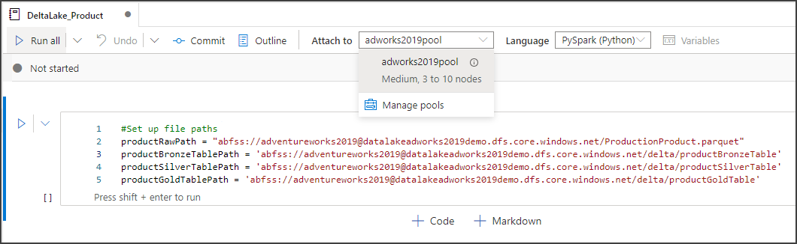

Click the + Code to add another cell, write this code to read the ProductionProduct.parquet file and display tis data. Run the cell.

```python
%%pyspark
df = spark.read.load(productRawPath, format='parquet')
display(df.limit(10))
```

Create a new cell to save the Bronze table. Write this code and run the cell.

```Python
#Save as Delta Table
df.write.mode("overwrite").format("delta").save(productBronzeTablePath)
```

Next read the bronze table and display its data.

```Python
#Load Bronze table into dataframe
rawProductDF = spark.read.format("delta").load(productBronzeTablePath)
rawProductDF.show()
```

Let's transform the data. Let's drop the fields rowguid and ModifiedDate. Create a new cell, write this code and run the cell.

```Python
#Drop id field and ModifiedDate
productDF2 = rawProductDF.drop('rowguid').drop('ModifiedDate')
productDF2.show()
```

Let's save this dataframe as the silver table. Create a new cell, write this code and run the cell.

```Python
#Save Silver table
productDF2.write.mode("overwrite").format("delta").option("overwriteSchema", "true").save(productSilverTablePath)
```

Let's filter out null values in a new cell. 

```Python
#Filtering out null values
productDF3 = productDF2.filter(productDF2.Color != 'null').filter(productDF2.Size != 'null').filter(productDF2.Class != 'null')
productDF3.show()
```

In a new cell, update the silver table.

```Python
#Update Silver Table
productDF3.write.mode("overwrite").format("delta").option("overwriteSchema", "true").save(productSilverTablePath)
```

In a new cell, generate a new model by grouping by Color and ProductLine and sort the result by Color. Run the cell

```Python
productDF4 = productDF3.groupBy("Color", "ProductLine").count().sort("Color")
productDF4.show(1000)
```

And finally, save the gold table in the last cell. Run it.

```Python
#Save Gold table
productDF4.write.mode("overwrite").save(productGoldTablePath)
```

Try the whole notebook by clicking the Run All button at the top. Once the execution completes successfully, click the Commit button to get the notebook commited.

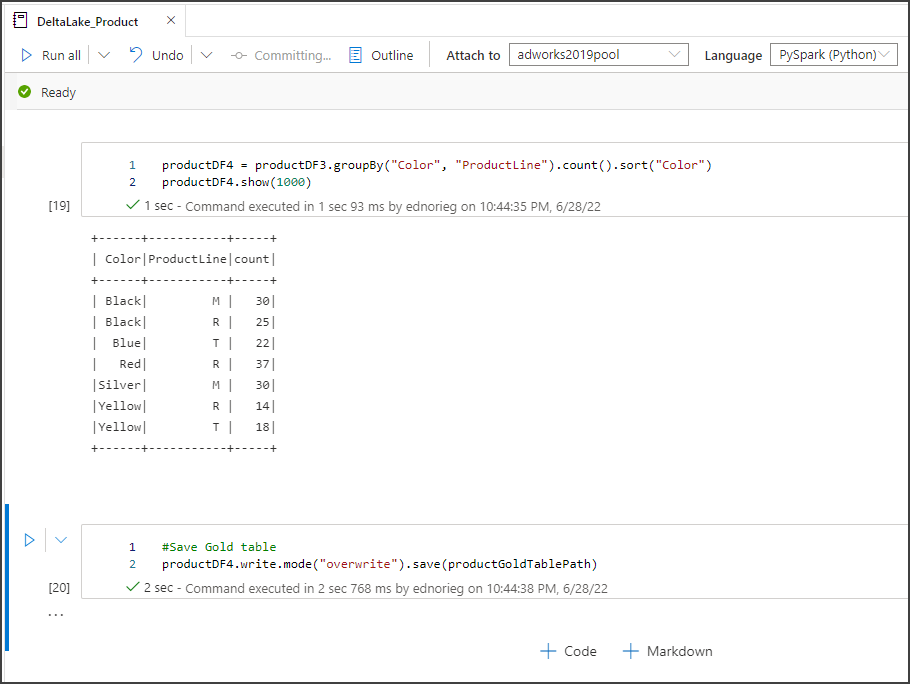

Let's merge this new notebook into the main branch. Expand the source control dropdown and click Create pull request. 

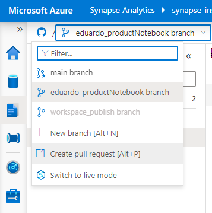

This will open a new browser tab and takes you to GitHub for you to create the pull request. Click on the Create pull request button in GitHub. Once the pull request is created, click the Merge pull request button and confirm the merge.

Once done, delete the branch.

Go back to the previous browser tab where you have Synapse Studio, and in the source control dropdown select Main branch. That will refresh the dropdown removing the deleted branch from it, and will show the newly created notebook in the Main branch.

As a result of running that notebook, if you go to the Data tab, click Linked, expand Azure Data Lake Storage Gen2, expand the primary storage account, click on adventureworks2019 and on the folder list double click on delta and productGoldTable, you will see the parquet files with the newly created model.

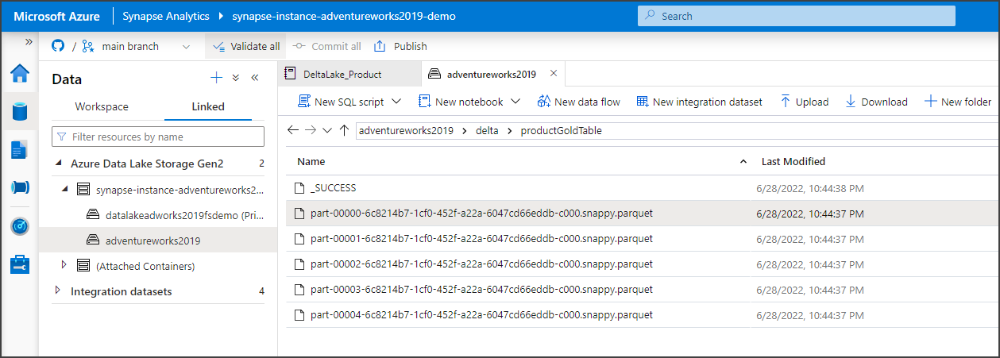

The models are created. In the next step let's ingest them into Azure dedicated SQL pool.

Next: **[Create a dedicated SQL pool](Ingest_To_DW.md#create-a-dedicated-sql-pool)**<br>